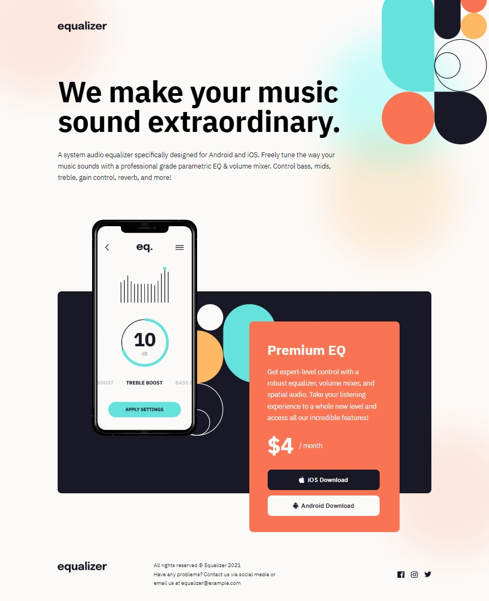
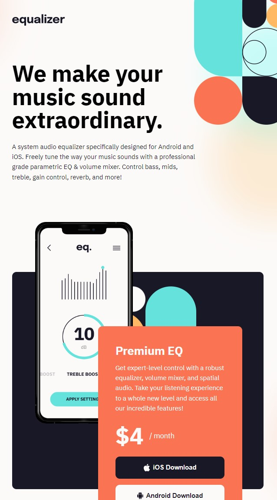

# Frontend Mentor - Equalizer landing page solution

This is a solution to the [Equalizer landing page challenge on Frontend Mentor](https://www.frontendmentor.io/challenges/equalizer-landing-page-7VJ4gp3DE). Frontend Mentor challenges help you improve your coding skills by building realistic projects. 

### The challenge

Users should be able to:

- View the optimal layout depending on their device's screen size
- See hover states for interactive elements

### Screenshot

**Desktop**

**Tablet**

**Mobile**

### Links

- Solution URL: https://github.com/aaronrubinstein/Equalizer-landing-page
- Live Site URL: https://aaronrubinstein.github.io/Equalizer-landing-page
